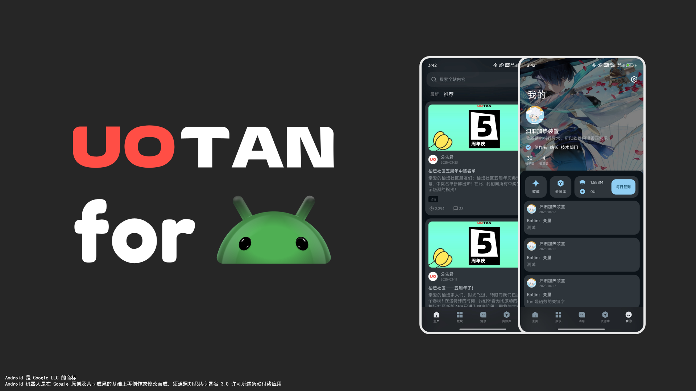

# UOTAN for Android

  

`UOTAN for Android (柚坛社区安卓端)` 是 [柚坛社区](https://www.uotan.cn/) 的半官方安卓端应用程序，适用于 Android Sdk 31 +，目标 Android Sdk 35。

## 序言

柚坛社区安卓端是由汩汩加热装置与柚坛社区团队 ([UOTAN](https://www.uotan.cn/)) 合作开发的安卓端应用程序。

其使用了 [Xenforo API](https://xenforo.com/community/pages/api-endpoints/)、[OkHttp](https://github.com/square/okhttp) 和 [Jsoup](https://github.com/jhy/jsoup) 等开源项目进行开发，柚坛社区安卓端也以以开放、包容、合作的态度拥抱开源社区，共筑开源生态。

柚坛社区安卓端希望借开源社区之力，共同编写一个流畅、完善的类 Xenforo 论坛客户端。

## 涉及到的 使用/修改/灵感 的开源项目

[AndroidX](https://github.com/androidx/androidx) 协议：Apache-2.0 作者：[The Android Open Source Project](https://github.com/androidx)

[ShapeBlurView](https://github.com/centerzx/ShapeBlurView) 协议：Apache-2.0（推测，未明确标注） 作者：[centerzx](https://github.com/centerzx)

[Haze](https://github.com/chrisbanes/haze) 协议：Apache-2.0 作者：[chrisbanes](https://github.com/chrisbanes)

[jsoup](https://github.com/jhy/jsoup) 协议：MIT 作者：[jhy](https://github.com/jhy)

[AndroidLiquidGlass](https://github.com/Kyant0/AndroidLiquidGlass) 协议：Apache-2.0 作者：[Kyant0](https://github.com/Kyant0)

[compose-webview](https://github.com/KevinnZou/compose-webview) 协议：Apache-2.0 作者：[KevinnZou](https://github.com/KevinnZou)

[SmartRefreshLayout](https://github.com/scwang90/SmartRefreshLayout) 协议：Apache-2.0 作者：[scwang90](https://github.com/scwang90)

[DialogX](https://github.com/kongzue/DialogX) 协议：Apache-2.0 作者：[kongzue](https://github.com/kongzue)

[Fetch](https://github.com/tonyofrancis/Fetch) 协议：Apache-2.0 作者：[tonyofrancis](https://github.com/tonyofrancis)

[ImageViewer](https://github.com/iielse/imageviewer) 协议：Apache-2.0（主流实现） 作者：[iielse](https://github.com/iielse)

[ShadowLayout](https://github.com/lihangleo2/ShadowLayout) 协议：Apache-2.0 作者：[lihangleo2](https://github.com/lihangleo2)

[PersistentCookieJar](https://github.com/franmontiel/PersistentCookieJar) 协议：Apache-2.0 作者：[franmontiel](https://github.com/franmontiel)

[ExViewPagerBottomSheet](https://github.com/xcc3641/ExViewPagerBottomSheet) 协议：Apache-2.0 作者：[xcc3641](https://github.com/xcc3641)

[Coil Compose](https://github.com/coil-kt/coil) 协议：Apache-2.0 作者：[coil-kt](https://github.com/coil-kt)

[Gustate AppBar](https://github.com/JiaGuZhuangZhi/Gustate-AppBar) 协议：Apache-2.0 作者：[JiaGuZhuangZhi](https://github.com/JiaGuZhuangZhi)

## 法律信息

**Android** 是 Google LLC 的商标。

**Android 机器人** 是在 Google 原创及共享成果的基础上再创作或修改而成，须遵照 [知识共享](https://creativecommons.org/licenses/by/3.0/) 署名 3.0 许可所述条款付诸应用。

**Gustate 组件** 是在 [@JiaGuZhuangZhi](https://github.com/JiaGuZhuangZhi) 原创及共享成果的基础上再创作或修改而成，须遵照 [Apache-2.0](https://www.apache.org/licenses/LICENSE-2.0) 许可所述条款付诸应用。

**“柚坛”艺术字图形** 为青岛柚坛网络科技有限公司在中华人民共和国的注册商标。

**UO**、**UOTAN** 和 **柚坛社区** 及它们的艺术字是青岛柚坛网络科技有限公司正在使用的服务名称与品牌标识，目前尚未注册为商标。青岛柚坛网络科技有限公司保留对上述名称的全部商业权利，任何 Fork、衍生项目或第三方不得擅自使用、修改或用于暗示与本公司存在关联、赞助或背书关系。
